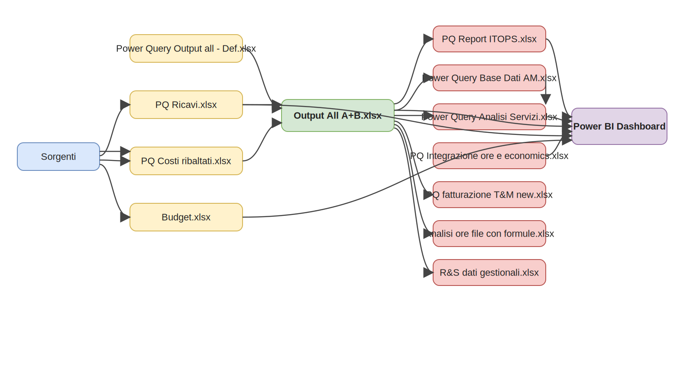
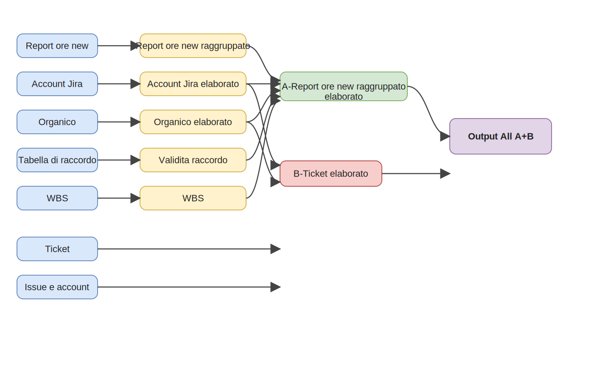
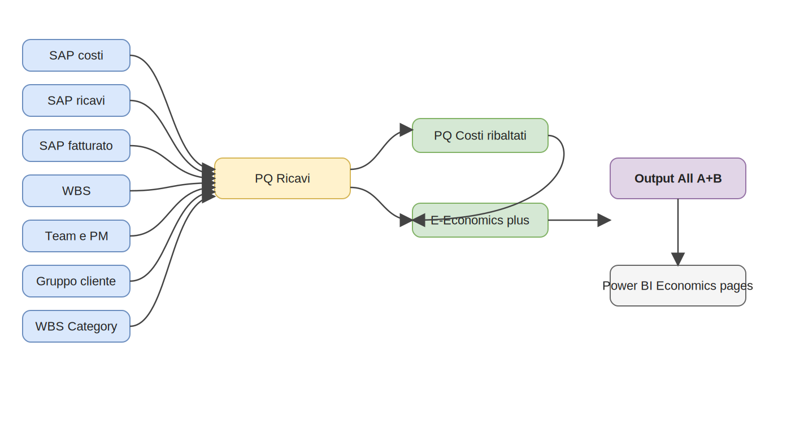

# Mappa delle Dipendenze della Dashboard Finale

## Scopo

Questo documento fornisce una vista compatta delle dipendenze tra:

1. pagine della dashboard finale
2. workbook di reporting / output Power Query
3. query intermedie
4. file sorgente originali

Serve a rispondere in modo chiaro a una domanda:

`Quali sorgenti dati e quali trasformazioni sono necessarie per costruire ciascuna parte della dashboard finale?`

## Layer finale di reporting

Dashboard finale principale:

- `power BI/Dashboard TXT Novigo_V2.pbix`

Versione estesa con monitoraggio progetti:

- `power BI/Dashboard TXT Novigo_V2 - con monitoraggio progetti.pbix`

Pagine principali trovate nel PBIX:

- `1.1-Giorni - Overview`
- `1.2-Giorni - Account e WBS`
- `1.3-Giorni - Trend`
- `1.4-Giorni - Focus R&D`
- `2.1-Economics actual - Overview`
- `2.2-Economics actual - Team commessa attività cliente`
- `2.3-Economics actual - Clienti`
- `2.4-Economics forecast - Ricavi overview`
- `2.5-Economics forecast - Ricavi clienti`

Pagine aggiuntive nella dashboard estesa:

- `3.1.1-Monitoraggio progetti - Overview company`
- `3.1.2-Monitoraggio progetti - Overview team`
- `3.2-Monitoraggio progetti - Gantt`
- `3.3-Monitoraggio progetti - Focus progetto`
- `3.4-Monitoraggio progetti - Capacity plan`

## Lineage ad alto livello

Diagramma draw.io sorgente:

- [lineage-high-level.drawio](./diagrams/lineage-high-level.drawio)

## Principali blocchi di dipendenza

## Blocco A: backbone ore / Jira / Tempo

Questo è il backbone operativo della dashboard.

### Sorgenti primarie

- `Input/input jira/Report ore new.xlsx`
- `Input/input jira/account jira.xlsx`
- `Input/input jira/Ticket light.xlsx`
- `Input/input jira/Ticket.xlsx`
- `Input/input jira/Issue dati aggiuntivi.xlsx`
- `Input/scarico cdg app/Tabella di raccordo.xlsx`
- `Input/input sap/wbs.xlsx`
- `Input/input axel/commesse.xlsx`
- `Input/input axel/ore axel.xlsx`
- `Input/input risorse/Organico.xlsx`

### Tabelle di riferimento principali

- `Input/Corrispondenze/Issue e account.xlsx`
- `Input/Corrispondenze/Account Category.xlsx`
- `Input/Corrispondenze/Team e PM.xlsx`
- `Input/Corrispondenze/IT OPS gruppi assignee.xlsx`
- `Input/Corrispondenze/Period e anno.xlsx`
- `Input/Corrispondenze/Gruppo cliente.xlsx`
- `Input/Corrispondenze/Eccezioni wbs new org.xlsx`

### Hub principale di query

- `Power Query Output all - Def.xlsx`

### Output principale

- `Output/Output All (A+B).xlsx`

### Query interne chiave identificate

Dentro `Power Query Output all - Def.xlsx`:

- `Account Jira elaborato`
- `Organico elaborato`
- `Report ore new raggruppato`
- `A-Report ore new raggruppato elaborato`
- `B-Ticket elaborato`
- `Linked issue`
- `Linked issue SD`
- `Linked issue SD elaborato`
- `Somma ore per account e periodo`
- `D-Ore Axel`
- `E-Economics`

### Cosa produce questo blocco

Fogli principali nel `Output All (A+B).xlsx` finale:

- `A-Report ore new raggruppato`
- `B-Ticket elaborato`
- `C-Report ore new interni`
- `Linked Issue SD`
- `E-Economics plus`
- `E+A+D raggruppati`
- `Ore SAP post rettifiche`
- `Ore SAP ante rettifiche`

## Blocco B: economics actual

### Sorgenti primarie

- `Input/input sap/wbs.xlsx`
- `Input/input sap/costi sap.xlsx`
- `Input/input sap/ricavi sap.xlsx`
- `Input/input sap/fatturato sap.xlsx`

### Tabelle di riferimento

- `Input/Corrispondenze/Team e PM.xlsx`
- `Input/Corrispondenze/Period e anno.xlsx`
- `Input/Corrispondenze/Gruppo cliente.xlsx`
- `Input/Corrispondenze/Eccezioni wbs new org.xlsx`
- `Input/Corrispondenze/WBS Category.xlsx`

### Workbook di query principali

- `PQ Ricavi.xlsx`
- `PQ Costi ribaltati.xlsx`

### Gruppi di query chiave identificati

Dentro `PQ Ricavi.xlsx`:

- `consuntivi`
- `ricavi`
- `fatturato`
- `Economics plus`
- `wbs+ric+cost+fatt`

Dentro `PQ Costi ribaltati.xlsx`:

- `Costi unpivot`
- `Ricavi unpivot`
- `Fatturato unpivot`
- `Economics plus con costi ribaltati`
- `WBS con valori ribaltati AC`

### Principale contributo in output

La sezione economics actual alimenta:

- `E-Economics plus`
- viste economics usate nelle pagine actual di Power BI

## Blocco C: economics forecast

### Sorgenti primarie

- `Input/file ricavi/ricavi.xlsx`
- `Input/forecast wcs/TXT WCS Forecast 2026.xlsx`
- file forecast storici in `Save/`
- stock storici avviate / potenziali dentro `PQ Ricavi.xlsx`

### Tabelle di riferimento

- `Team e PM.xlsx`
- `WBS Category.xlsx`
- `Gruppo cliente.xlsx`
- `Eccezioni wbs new org.xlsx`
- `Period e anno.xlsx`

### Workbook di query principale

- `PQ Ricavi.xlsx`

### Gruppi di query chiave identificati

- `previsioni avviate`
- `previsioni potenziali`
- `Storico forecast completo`
- `Storico forecast WCS`
- `Storico forecast WCS canoni`
- `Storico avviate`
- `Storico potenziali gross`
- `Storico potenziali net`

### Contributo in output

Alimenta le pagine Power BI:

- `2.4-Economics forecast - Ricavi overview`
- `2.5-Economics forecast - Ricavi clienti`

## Blocco C2: Budget

### Sorgente primaria

- `Input/budget/Budget.xlsx`

### Contributo in output

Il materiale di review elenca esplicitamente il Budget come input di Power BI. Anche quando il Budget è visivamente incorporato in altre pagine dashboard, va trattato come un blocco di dipendenza autonomo.

## Blocco D: reporting servizi IT OPS

### Sorgente upstream

- `Output/Output All (A+B).xlsx`

### Riferimenti aggiuntivi

- `Input/Corrispondenze/IT OPS gruppi assignee.xlsx`
- `Input/Corrispondenze/IT OPS progetti Service Desk.xlsx`
- `Input/Corrispondenze/Account Category.xlsx`
- `Input/Corrispondenze/Period e anno.xlsx`
- `Input/Corrispondenze/Team e PM.xlsx`
- `Input/input jira/account jira.xlsx`

### Workbook di query principale

- `PQ Report ITOPS.xlsx`

### Gruppi di query chiave identificati

- `1-base report service`
- `2-base report effort dettaglio`
- `2-base report effort PowerBI`
- `Linked issue SD con ore`
- `Ore SD completo`
- `tempo issue`
- `tempo padre`

### Contributo in output

Alimenta le sezioni di service/effort reporting usate nella BI finale.

## Blocco E: AM e analisi servizi

### Sorgente upstream

- `Output/Output All (A+B).xlsx`

### Sorgenti aggiuntive

- `Input/input jira/Issue dati aggiuntivi.xlsx`
- `Input/dati da contratti/Contratti_SLAeKPI.xlsx`
- `Input/input risorse/Organico.xlsx`
- `Input/input jira/AM - Eccezioni account jira.xlsx`

### Tabelle di riferimento

- `Account Category.xlsx`
- `IT OPS gruppi assignee.xlsx`
- `Period e anno.xlsx`

### Workbook di query

- `Power Query Base Dati AM.xlsx`
- `Power Query Analisi Servizi.xlsx`

### Gruppi di query chiave identificati

Dentro `Power Query Base Dati AM.xlsx`:

- `Issue arricchito`
- `Ore arricchito`
- `Filiera completa`
- `Filiera completa con ore`
- `Filiera SD con ore`
- `Check account mancanti`

Dentro `Power Query Analisi Servizi.xlsx`:

- `Analisi servizi`
- `Backlog_fine_periodo`
- `Perimetro_analisi_servizi`
- `SLAeKPI`

### Contributo in output

Alimenta viste di backlog servizi, SLA/KPI e service analysis.

## Blocco F: integrazione ore + economics

### Sorgenti upstream

- `Output/Output All (A+B).xlsx`
- `Input/input sap/wbs.xlsx`
- `Input/input risorse/Organico.xlsx`
- `Input/Corrispondenze/Team e PM.xlsx`
- `Input/Corrispondenze/WBS Category.xlsx`
- `Input/Corrispondenze/Gruppo cliente.xlsx`
- `Input/Corrispondenze/Eccezioni wbs new org.xlsx`

### Workbook principale

- `PQ Integrazione ore e economics.xlsx`

### Gruppi di query chiave identificati

- `3-E+A+D raggruppati`
- `A-raggruppato rettificato`
- `D-Axel-SAP def`
- `E-raggruppato`

### Contributo in output

Questo blocco è il ponte tra ore operative ed economics, ed è verosimilmente una delle sorgenti principali dietro le viste combinate di margine / produttività.

## Matrice dipendenze delle pagine dashboard

| Pagina dashboard | Layer workbook principale | Principali sheet / query output | Principali sorgenti originali |
|---|---|---|---|
| `1.1-Giorni - Overview` | `Output All (A+B).xlsx` | `A-Report ore new raggruppato`, `B-Ticket elaborato` | `Report ore new`, `Account Jira`, `Ticket`, `Organico`, `Tabella di raccordo`, `WBS` |
| `1.2-Giorni - Account e WBS` | `Output All (A+B).xlsx` | `A-Report ore new raggruppato`, `B-Ticket elaborato` | come sopra più `Issue e account`, `Account Category`, `Team e PM` |
| `1.3-Giorni - Trend` | `Output All (A+B).xlsx` | `A-Report ore new raggruppato` per periodo | `Report ore new`, `Period e anno`, `Organico` |
| `1.4-Giorni - Focus R&D` | `Output All (A+B).xlsx`, `R&S dati gestionali.xlsx` | ore filtrate R&D | `Report ore new`, `Account Jira`, `Programmi R&D`, `Organico` |
| `2.1-Economics actual - Overview` | `PQ Ricavi`, `PQ Costi ribaltati`, `Output All (A+B)` | `E-Economics plus`, output ribaltati | `SAP costi`, `SAP ricavi`, `SAP fatturato`, `WBS`, `Gruppo cliente`, `Team e PM` |
| `2.2-Economics actual - Team commessa attività cliente` | stesso layer | viste economics per team/attività cliente | come sopra più `WBS Category`, `Eccezioni wbs new org` |
| `2.3-Economics actual - Clienti` | stesso layer | economics actual a livello cliente | come sopra |
| `2.4-Economics forecast - Ricavi overview` | `PQ Ricavi.xlsx` | `Storico forecast completo`, `previsioni avviate`, `previsioni potenziali` | `ricavi.xlsx`, `TXT WCS Forecast`, tabelle reference |
| `2.5-Economics forecast - Ricavi clienti` | `PQ Ricavi.xlsx` | output forecast per cliente | come sopra |
| `3.x Monitoraggio progetti` | misto, non completamente ricostruito dai soli metadati file | probabilmente output issue + economics + linked planning | `Ticket`, `Issue dati aggiuntivi`, `Output All`, layer economics |

## Vista dipendenze query per il flusso core delle ore

Diagramma draw.io sorgente:

- [hours-core-flow.drawio](./diagrams/hours-core-flow.drawio)

## Vista dipendenze query per il flusso economics

Diagramma draw.io sorgente:

- [economics-flow.drawio](./diagrams/economics-flow.drawio)

## Fatti di dipendenza più importanti

### 1. `Output All (A+B).xlsx` è la dipendenza centrale

Se questo workbook è errato o non aggiornato, la maggior parte del reporting downstream è errata o non aggiornata.

### 2. La logica ore dipende prima dai worklog, non dall'anagrafica issue

La dipendenza chiave effettiva è:

- `Report ore new` -> `PQ Issue e account` -> `Issue e account` -> `B-Ticket elaborato`

Per questo la history issue/account è una dipendenza business critica.

### 3. Gli economics sono separati dalle ore e uniti successivamente

Ore operative e economics SAP non nascono nello stesso modello. Vengono costruiti separatamente e integrati più avanti.

### 4. Le tabelle reference non sono accessorie, sono strutturali

File come:

- `Account Category`
- `Team e PM`
- `WBS Category`
- `Issue e account`
- `Eccezioni wbs new org`

fanno parte della logica di trasformazione, non sono solo arricchimenti.

### 5. Il processo ha sia run di controllo sia run storicizzati di chiusura

La documentazione di review lo rende esplicito:

- l'elaborazione inframensile è usata per i controlli
- l'elaborazione di fine mese produce l'output `A+B` storicizzato

Quindi l'analisi delle dipendenze dovrebbe distinguere i flussi operativi di QA dagli output ufficiali di reporting storico.

## Indicazione per la migrazione

Per il nuovo stack Dagster/dbt/Metabase, l'ordine pulito delle dipendenze dovrebbe diventare:

1. ingest delle sorgenti operative raw
2. ingest di tutte le tabelle reference
3. costruzione dei mart canonici per ore, issue, account, WBS, economics
4. costruzione dei reporting mart per le pagine dashboard
5. costruzione delle dashboard Metabase a partire solo dai reporting mart

Questa futura catena di dipendenze sostituirà la catena attuale di workbook mostrata sopra.
